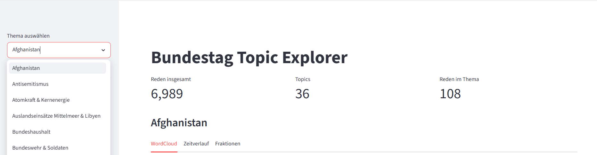
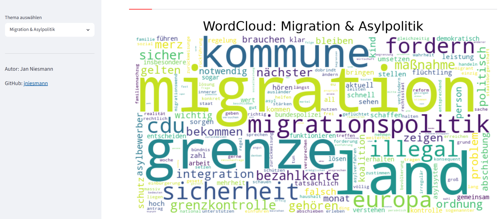
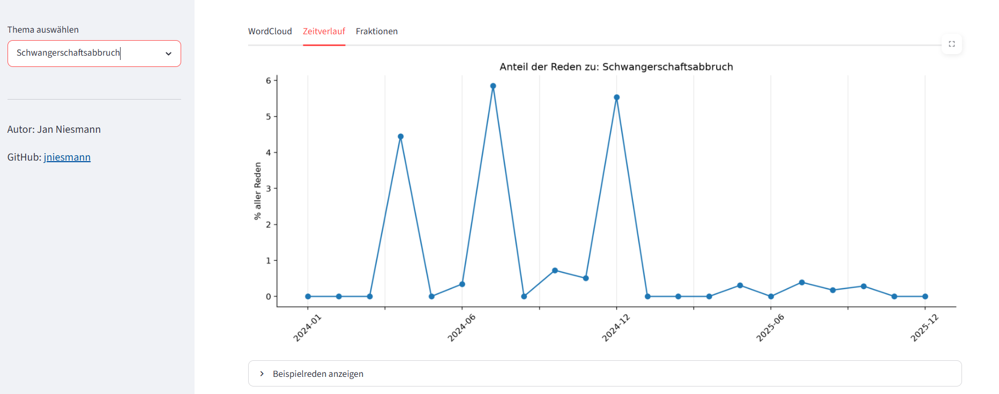

# Bundestag Topic Explorer

Interaktive Analyse von Bundestagsreden mittels NLP und Topic Modeling.

Das Projekt verarbeitet die offiziellen XML-Protokolle der Plenardebatten des Deutschen Bundestages, extrahiert Redebeiträge, identifiziert thematische Schwerpunkte mit BERTopic und stellt die Ergebnisse in einem interaktiven Streamlit-Dashboard dar.

## Live Demo

http://141.5.107.20:8501

## Dashboard

Das Dashboard ermöglicht die Exploration politischer Debatten nach Themenclustern.

Für jedes identifizierte Thema werden dargestellt:

- WordCloud der häufigsten Begriffe
- Zeitliche Entwicklung des Themas
- Fraktionsspezifische Themenschwerpunkte
- Repräsentative Beispielreden

### Themenübersicht



### Beispiel: WordCloud aller Reden zum Thema Migration & Asylpolitik



### Beispiel: Plenardebatten zum Thema Schwangerschaftsabbruch im Zeitverlauf



## Datenquelle

Die Daten stammen aus den öffentlich verfügbaren XML-Protokollen des Deutschen Bundestages:

https://www.bundestag.de/services/opendata

Berücksichtigt wurden Plenardebatten der Jahre 2024 und 2025.

## Methodik

### 1. Datenextraktion

- Download der XML-Protokolle
- Extraktion einzelner Redebeiträge
- Erfassung von Sprecherinformationen, Fraktion und Datum

### 2. Textvorverarbeitung

- spaCy (`de_core_news_sm`)
- Lemmatisierung
- Entfernung deutscher Stopwörter
- Entfernung bundestagsspezifischer Stopwörter

### 3. Topic Modeling

- SentenceTransformer Embeddings
- BERTopic
- Manuelle Benennung der Themencluster anhand von Schlüsselbegriffen und repräsentativen Reden

### 4. Dashboard

- Streamlit
- Matplotlib
- WordCloud

## Projektstruktur

```text
bundestag-topic-analysis/
├── bt_pipeline/
├── data/
├── dashboard.py
├── main.py
├── Dockerfile
├── compose.yaml
├── requirements.txt
└── README.md
```

## Lokale Ausführung

### Dashboard

```bash
streamlit run dashboard.py
```

### Pipeline

```bash
python main.py
```

## Docker

```bash
docker compose up -d --build
```

## Verwendete Technologien

- Python
- pandas
- spaCy
- BERTopic
- SentenceTransformers
- Streamlit
- Docker / Podman

## Autor

Jan Niesmann

GitHub: https://github.com/jniesmann
